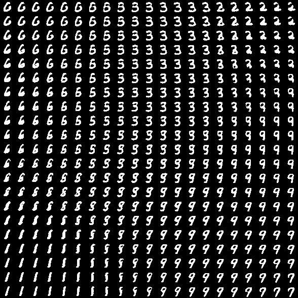

# vae
Variational auto-encoder for MNIST
based on Auto-Encoding Variational Bayes, http://arxiv.org/abs/1312.6114
https://github.com/y0ast/VAE-Torch

Model:
nn.Sequential {
  [input -> (1) -> (2) -> output]
  (1): nn.Sequential {
    [input -> (1) -> (2) -> (3) -> output]
    (1): nn.Linear(784 -> 500)
    (2): cudnn.Tanh
    (3): nn.ConcatTable {
      input
        |`-> (1): nn.Linear(500 -> 2)
        |`-> (2): nn.Linear(500 -> 2)
         ... -> output
    }
  }
  (2): nn.ConcatTable {
    input
      |`-> (1): nn.Identity
      |`-> (2): nn.Sequential {
      |      [input -> (1) -> (2) -> output]
      |      (1): nn.Gaussian
      |      (2): nn.Sequential {
      |        [input -> (1) -> (2) -> (3) -> (4) -> output]
      |        (1): nn.Linear(2 -> 500)
      |        (2): cudnn.Tanh
      |        (3): nn.Linear(500 -> 784)
      |        (4): cudnn.Sigmoid
      |      }
      |    }
       ... -> output
  }
}
